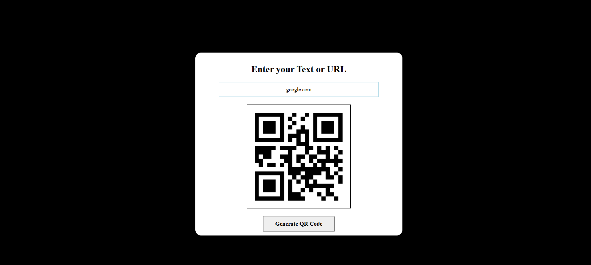

# QR Code Generator 🧾🔳

A simple and responsive web app that allows users to generate QR codes from any text or URL. Built using **HTML**, **CSS**, and **JavaScript**, this project is ideal for learning how to interact with external APIs and update the DOM dynamically.

---

## 🚀 Features

- 🔤 Accepts any text or URL input
- 🔳 Generates a QR code using a free API
- 🖼️ Displays the QR code instantly on the page

---

## 🌐 Live Preview
👉 [Click Here to See It Live]((https://sarthdhakade963.github.io/QR_Code_Generator/)

## 📸 Demo

---

## 🛠️ Tech Stack

- HTML5
- CSS3
- JavaScript (Vanilla)
- [api.qrserver.com](https://goqr.me/api/) – used for QR code generation

---

